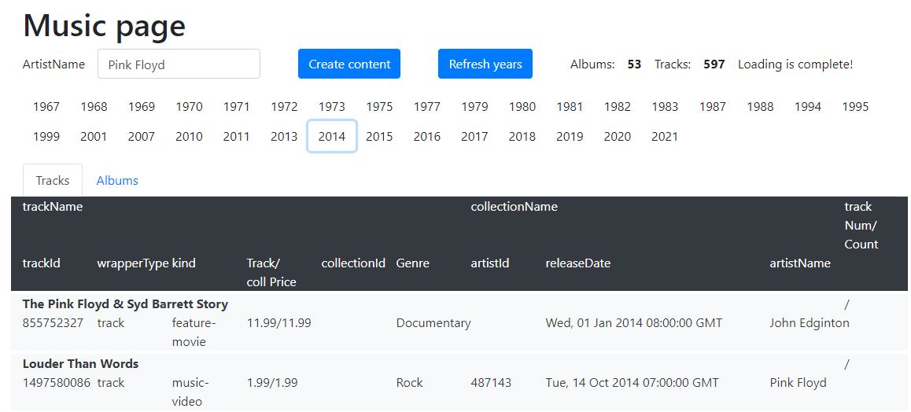

# PinkFloyd

Variant 1. Using API https://affiliate.itunes.apple.com/resources/documentation/itunes-store-web-service-search-api/ get all data about “Pink Floyd" and store it into your DB: kind, collectionName, trackName, collectionPrice, trackPrice, primaryGenreName, trackCount, trackNumber, releaseDate. Output the data for the year of releaseDate (the year is set) in form of a table and sort them by trackPrice in descending order.

### Result

